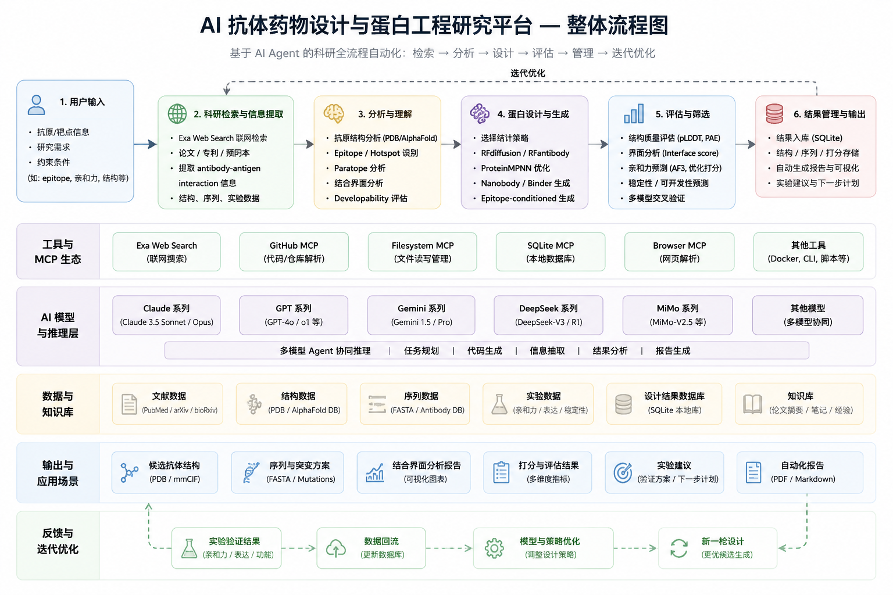

# AI Antibody Research Agent

> 基于 Claude Code + MCP + Exa + Protein Design Workflow 的 AI 抗体药物设计与蛋白工程研究平台

---

# 项目简介

AI Antibody Research Agent 是一个面向抗体药物设计（Antibody Drug Discovery）与蛋白工程（Protein Engineering）的 AI 科研 Agent 平台。

该系统结合：

- Claude Code
- MCP（Model Context Protocol）
- Exa Web Search
- RFdiffusion
- ProteinMPNN
- SQLite
- 多模型协同推理

实现从：

```txt
科研检索 → 结构分析 → Binder 生成 → 结果评估 → 数据管理 → 迭代优化
```

的半自动化 AI 科研工作流。

---

# 系统整体流程图



---

# 核心工作流

```txt
用户输入 Target Antigen / Epitope
        ↓
Exa Web Search 自动检索论文
        ↓
提取 antibody-antigen interaction
        ↓
Epitope / Hotspot 分析
        ↓
RFdiffusion 生成候选 Binder
        ↓
ProteinMPNN 优化序列
        ↓
AF2 / Interface Score 评估
        ↓
结果写入 SQLite 数据库
        ↓
自动生成报告与实验建议
```

---

# 技术栈

## AI Agent

- Claude Code
- Codex
- OpenClaw
- MCP

## 模型

- Claude 系列
- GPT 系列
- Gemini 系列
- DeepSeek 系列
- MiMo 系列

## 生物计算

- RFdiffusion
- RFantibody
- ProteinMPNN
- AlphaFold
- Chai-1

---

# 快速开始

## 克隆仓库

```bash
git clone https://github.com/yourname/AI-Antibody-Research-Agent.git
cd AI-Antibody-Research-Agent
```

## 安装依赖

```bash
pip install -r requirements.txt
```

## 启动 Claude Code

```bash
claude
```

## 测试搜索

```txt
搜索最近的 antibody foundation model 论文
```

---

# License

MIT License
